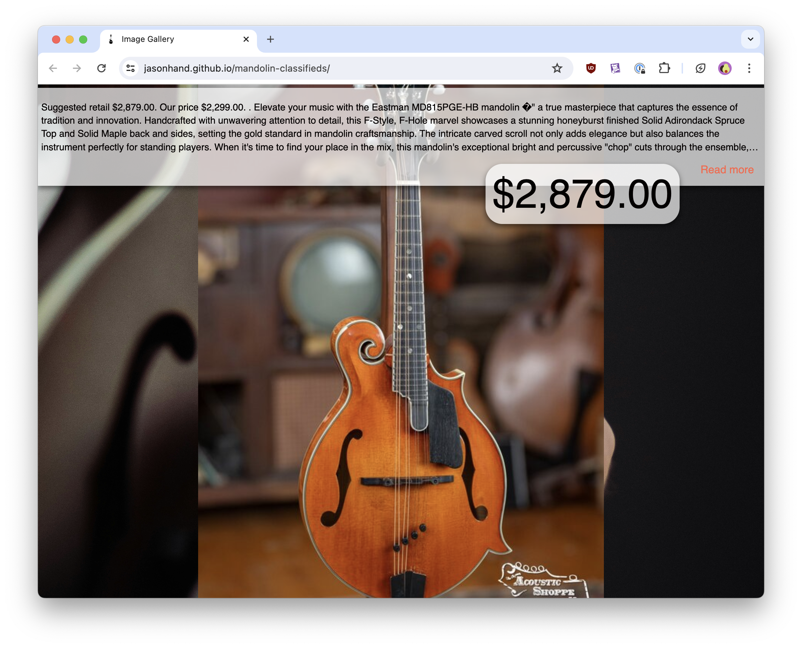

# Mandolin Classifieds Viewer
Wrapper for MandolinCafe.com snapshot of classified listings

## How to Use This Project

1. Fork this repository.
2. From the root directory, run `python -m http.server 8001` to start a web server on your local machine.
3. Browse to `http://localhost:8001/` in your browser to view the application.

>NOTE: Python must be installed locally.

>NOTE: The classified ads data was last retreived on 2/11/2024) so many of the images and listings are outdated and produce a 404 error as of today (5/9/2024).
